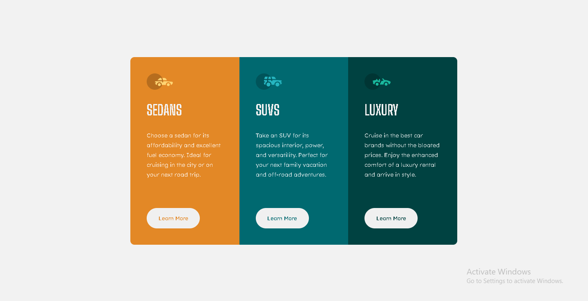

# Frontend Mentor - 3-column preview card component solution

This is a solution to the [3-column preview card component challenge on Frontend Mentor](https://www.frontendmentor.io/challenges/3column-preview-card-component-pH92eAR2-). Frontend Mentor challenges help you improve your coding skills by building realistic projects.

## Table of contents

- [Overview](#overview)
  - [The challenge](#the-challenge)
  - [Screenshot](#screenshot)
  - [Links](#links)
- [My process](#my-process)
  - [Built with](#built-with)
- [Author](#author)

## Overview

### The challenge

Users should be able to:

- View the optimal layout depending on their device's screen size
- See hover states for interactive elements

### Screenshot

### Links

- Solution URL: [Github repo](https://github.com/MemoBiomy/3-column-cards)
- Live Site URL: [Add live site URL here](https://memobiomy.github.io/3-column-cards/)

## My process

### Built with

- HTML5
- CSS3
- Flexbox

## Author

- Github - [@MemoBiomy](https://github.com/MemoBiomy)
- Frontend Mentor - [@MemoBiomy](https://www.frontendmentor.io/profile/MemoBiomy)

**Note: Delete this note and add/remove/edit lines above based on what links you'd like to share.**
